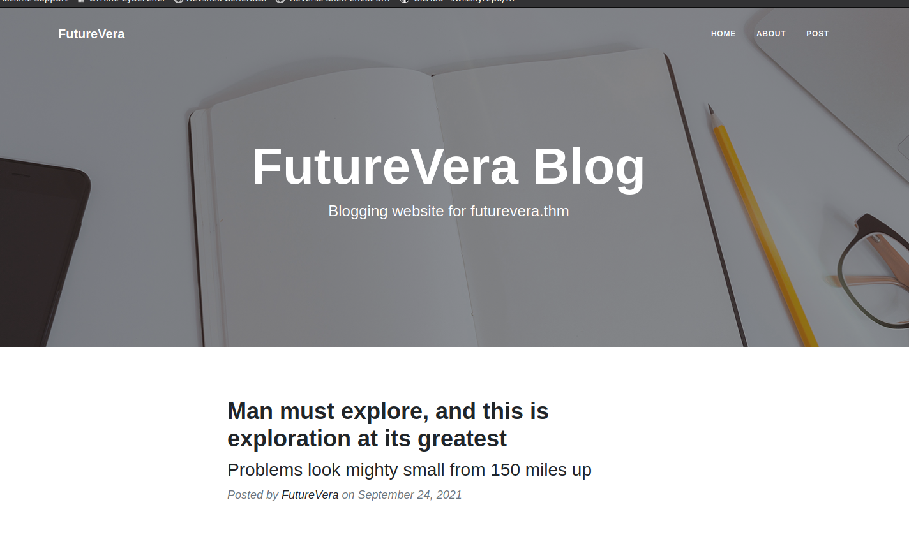

# TakeOver - TryHackMe
This challenge revolves around subdomain enumeration.

Link : https://tryhackme.com/room/takeover

## Step 1
First of all, you have to add the vhost in the /etc/hosts file of your computer

````bash
echo "10.10.86.212 futurevera.thm" >> /etc/hosts
````

## Step 2 
Let's start with the usual nmap : 
````bash
nmap 10.10.86.212 -A
````

We can see that ports 22, 80 and 443 are open.

## Step 3
On the address https://futurevera.thm, you can see a site but I did not find anything wrong. The same http address redirects to the https site.

But the room description gives a clue : 
> *This challenge revolves around subdomain enumeration.*

So we will be able to enumerate the subdomains with ffuf (Note that you can also do it with gobuster)

````bash
ffuf -w /usr/share/wordlists/SecLists/Discovery/DNS/namelist.txt -H "Host: FUZZ.futurevera.thm" -u http://10.10.86.212
````


You can filter the result with the -fs flag to exclude results with a size of 0

````bash
ffuf -w /usr/share/wordlists/SecLists/Discovery/DNS/namelist.txt -H "Host: FUZZ.futurevera.thm" -u http://10.10.86.212 -fs 0
````


So we discovered 2 subdomains, but when we go to them, we can see this message.

````bash
curl --header "Host: portal.futurevera.thm" 10.10.86.212 -k
````


Same with payroll subdomain
````bash
curl --header "Host: payroll.futurevera.thm" 10.10.86.212 -k
````


Nothing usable for the moment.

Our previous Fuzzing was in http. Let's do the same with https.
````bash
ffuf -w /usr/share/wordlists/SecLists/Discovery/DNS/namelist.txt -H "Host: FUZZ.futurevera.thm" -u https://10.10.86.212 
````


Again, we can filter our results by excluding files with a size of 4605 
````bash
ffuf -w /usr/share/wordlists/SecLists/Discovery/DNS/namelist.txt -H "Host: FUZZ.futurevera.thm" -u https://10.10.86.212 -fs 4605
````


These subdomains seem to have a few things, let's go see what they are. To do this, we need to add these subdomains to the /etc/hosts file. 

````bash
echo "10.10.86.212 blog.futurevera.thm support.futurevera.thm" >> /etc/hosts
````

**Blog :** 

Nothing interesting.

**Support :**


It says (like in the task description) that they are rebuilding the support website.

And checking the ssl certificate  
*(Click on the cadena -> Connection not secure -> Remove Exception)*


We can see that there is a "Subject Alt Name".


> secrethelpdesk934752.support.futurevera.thm

Let's also add it to the hosts file

````bash
echo "10.10.86.212 secrethelpdesk934752.support.futurevera.thm" >> /etc/hosts
````

Open the browser, and go to the address.

If we go in https, we fall on the main site, but if we connect on it in http, we are redirected to the flag :) 


## Conclusion:
This is a box that is considered easy, but nevertheless I lost a lot of time because I had forgotten to check the ssl certificate which is a basic check to do under normal circumstances. So I would say **Never forget to do the basic checks**.
